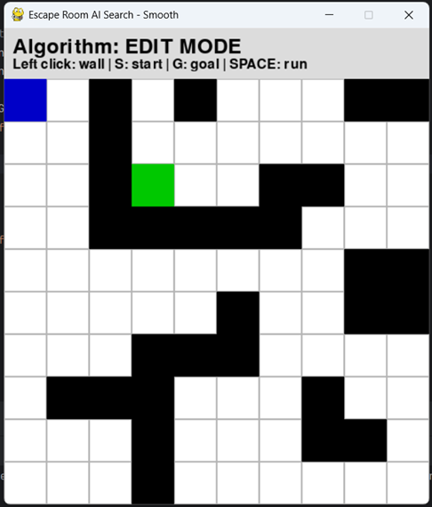
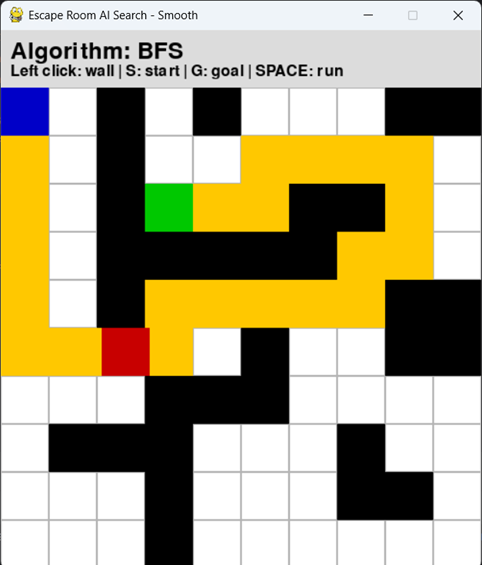
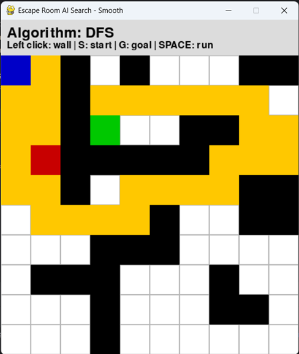
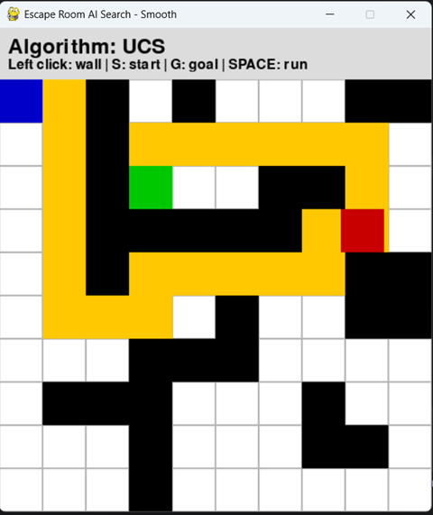
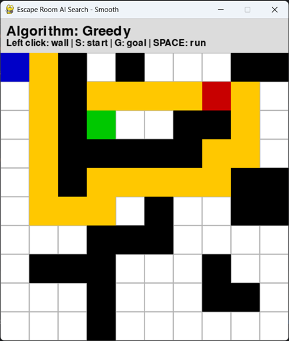
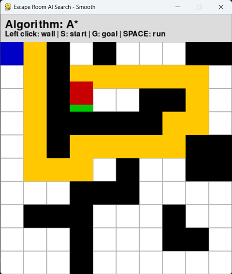

## Проект на тема „Споредба и примена на алгоритми за пребарување во простор на состојби“ - „AI Escape Grid“

## Мила Блажевска 231100

- Опис на проектот

Играта „AI Escape Grid“ е визуелизација на алгоритми за пребарување во
едноставен grid-based лавиринт. Играчот може да постави почетна позиција
(START), целна позиција (GOAL) и пречки (walls). Со лев клик на маусот се додаваат
или бришат пречките. Со копчето S на тастатурата се поставува нова START
позиција, а со G се поставува нова GOAL позиција. Потоа со клик на space се пушта
визуелизација на алгоритмите за пребарување во простор на состојби кои
автоматски го наоѓаат патот од START до GOAL.

Играта поддржува 5 алгоритми од кои 3 неинформирани:

- BFS (Breadth-First Search) кој прво пребарува низ најплитки јазли,
- DFS (Depth-First Search) кој прво пребарува низ најдлабоки јазли,
- UCS (Uniform Cost Search) кој пребарува пат со најниска цена.
  
И два информирани алгоритми за пребарување:
- Greedy Best-First Search кој користи хевристика за најбрз пат до целта и
- A* Search кој комбинира cost и хевристика за оптимален пат.
  Алгоритмите се извршуваат по редослед BFS, DFS, UCS, Greedy и A*, а името на
  тековниот алгоритам се прикажува над мрежата.
  Агентот (црвен квадрат) се движи по патеката до целната позиција, патеката на
  алгоритамот се прикажува во жолто, почетната позиција е сина, целната позиција
  е зелен, пречките се црни, а слободни клетки се сиви.

Анимацијата е smooth, т.е. агентот се движи постепено, без прескокнување по
клетки, што го олеснува визуелното следење на патеката.

- Цел на проектот

Целта на играта е да се разбере како различни алгоритми за пребарување
функционираат во простори на состојби, да се визуелизира како секој алгоритам

избира пат низ мрежата со пречки и да се споредат алгоритмите по брзина и патека
до целната позиција.
Визуелизацијата ги прикажува специфичните карактеристики на секој алгоритам.

- BFS секогаш наоѓа патека која е најкратка во број на чекори.
- DFS понекогаш наоѓа подолг пат бидејќи оди длабоко пред да проверува
  други патеки.
- UCS ако сите чекори имаат еднаков трошок наоѓа ист пат како BFS, а ако
  чекорите имаат различен трошок наоѓа најевтиниот пат.
- Greedy Best-First алгоритамот следи само хевристика и патеката може да
  биде подолга.
- A* го комбинира трошокот и хевристиката и најчесто наоѓа оптимален пат.

Интерактивното поставување на препреките (лавиринтот) овозможува креирање на
различни сценарија. Целта е играчот да може сам да постави своја состојба во која
сака да ги спореди дадените алгоритми за пребарување.

- Опис на решение

Кодот е поделен на 3 логички слоја:

- Модел (логика на проблемот) – EscapeGrid (Problem subclass)
- Алгоритми за пребарување - BFS, DFS, UCS, Greedy, A* (земени од
  UninformedSearch / InformedSearch)
- Презентација (UI / Visualization) - pygame (draw_grid, animate_smooth, main
  loop)
  Со ова решението е формирано како MVC pattern:

-  Model = Problem
- Controller = search algorithms
- View = pygame

Во класата EscapeGrid се дефинира самиот проблем. Таа наследува од класата
Problem и ги имплементира клучните методи кои им се потребни на алгоритмите за
пребарување. EscapeGrid е адаптер меѓу конкретниот проблем (grid) и генеричките
алгоритми. Чува почетна состојба, целна состојба о матрица на светот (grid).

```py
class EscapeGrid(Problem):
    def __init__(self, initial, goal, grid):
        super().__init__(initial, goal)
```

Ова додава зависност (dependency injection)

- Методот actions ја враќа листата на сите можни соседни состојби во кои
  агентот може да се придвижи од дадена позиција, при што се внимава да не се
  излезе од границите на мрежата и да не се влезе во пречка. Тој е генератор на
  successors. Динамички го гради графот во runtime односно нема претходно
  изграден граф во меморија. Графот не постои експлицитно, туку имплицитно. Тој се
  генерира само кога треба. Со ова се постигнува мемориска ефикасност.

- Методот result го дефинира резултатот од примената на некоја акција, што
  во овој случај е едноставно новата позиција.

- Методот path_cost дефинира дека секое движење има цена 1 (return c + 1),
  што значи дека сите чекори се еднакво „скапи“. Со ова проблемот станува weighted
  graph и UCS и A* можат да работат. С е досегашната цена која ја има поминато
  агентот.

- Методот h е хевристичка функција и го пресметува Менхетен растојанието
  (return abs(x1-x2) + abs(y1-y2)) од тековната позиција до целта, што се користи кај
  информираните алгоритми (Greedy и A*).

- Визуелниот дел е реализиран со pygame. Мрежата се црта како низа од
  квадратчиња, каде црните полиња се пречки, сината клетка е стартната позиција,
  зелената е целта, а жолтите клетки го прикажуваат пронајдениот пат. Над мрежата
  има header во кој се прикажува името на алгоритмот кој моментално се извршува и
  кратки инструкции за користење.
  draw_grid нема бизнис логика. Тој само чита состојба и црта пиксели.

- Функцијата run_algorithms го креира објектот problem од класата
  EscapeGrid и ги повикува сите алгоритми: BFS, DFS, UCS, Greedy и A*. Секој
  алгоритам враќа решение во форма на низа од состојби (патека). Доколку не постои
  решение, се прикажува порака дека нема пат. Доколку постои, се повикува
  функцијата animate_smooth.

BFS, DFS, UCS, Greedy и A*се чисти алгоритми кои работат со било кој Problem и не
знаат ништо за конкретниот проблем, со што се постигнува абстракција.

- Функцијата animate_smooth е задолжена за мазната анимација на агентот.
  Наместо агентот да „скока“ од една клетка во друга, неговото движење се
  интерполира во повеќе мали чекори  (frames). За секој чекор од патеката, се
  пресметува разликата во позиција и агентот постепено се поместува во 10 мали
  движења, со кратка пауза од 30 милисекунди помеѓу секој кадар. На тој начин се
  добива мазно и природно движење, слично на анимација во видео игра.
  animate_smooth прави линеарна интерполација:

  dx = (target_x - current_x) / frames

  dy = (target_y - current_y) / frames


- Главната функција main претставува главната pygame петља. Таа има event-
  driven архитектура. Постојано ги слуша настаните од корисникот (клик, тастатура,
  затворање на прозорецот), ја ажурира мрежата и повторно ја исцртува сцената. Ова
  овозможува апликацијата да биде интерактивна и корисникот во реално време да
  го менува проблемот и да ги споредува резултатите од различни алгоритми.

Целокупно, решението симулира класичен проблем на пребарување во простор на
состојби и овозможува практична и визуелна споредба на неинформирани и
информирани алгоритми.

- Опис на методот actions и функцијата animate_smooth

4.1. Методот actions

```py
    def actions(self, state):
    x, y = state
    moves = []
    for dx, dy in [(-1, 0), (1, 0), (0, -1), (0, 1)]:
        nx, ny = x + dx, y + dy
        if 0 <= nx < self.rows and 0 <= ny < self.cols:
            if self.grid[nx][ny] == 0 or (nx, ny) == self.goal:
                moves.append((nx, ny))
    return moves
```

Овoj метод одговара на прашањето: „Од оваа состојба, каде смееме да одиме
понатаму?“

Тој го дефинира графот на пребарување.
Состојбата state = (x, y) е позиција на агентот во мрежата.
Successorот се генерира преку for dx, dy in [(-1,0),(1,0),(0,-1),(0,1)]: што всушност
претставуваат координати на мрежата (x, y) и значат горе, доле, лево и десно.
Проверката (if 0 <= nx < self.rows and 0 <= ny < self.cols:) спречува излегување од
мапата и индекси надвор од матрица.
Проверката (if self.grid[nx][ny] == 0 or (nx, ny) == self.goal:) значи:
0 = празно поле, следува може да се оди на истото.
1 = ѕид, следува не може да се стапне на истото.
Ако е полето е GOAL (секогаш е дозволено)
Враќа (return moves) листа од нови состојби.

4.2. Функција animate_smooth

```py
def animate_smooth(path, name):
    if not path:
        return
    agent_pos = [START[1] * cell, START[0] * cell + header]  # x, y

    draw_grid(path=path, algo_name=name, agent_pos=agent_pos)
    pygame.time.delay(200)

    for step in path:
        target_pos = [step[1] * cell, step[0] * cell + header]
        frames = 10
        dx = (target_pos[0] - agent_pos[0]) / frames
        dy = (target_pos[1] - agent_pos[1]) / frames

        for _ in range(frames):
            agent_pos[0] += dx
            agent_pos[1] += dy
            draw_grid(path=path, algo_name=name, agent_pos=agent_pos)
            pygame.time.delay(30)  # delay per frame

    draw_grid(path=path, algo_name=name, agent_pos=target_pos)
    pygame.time.delay(200)
```

Како влезни параметри прима path (листа од состојби) и name (име на алгоритам).
Почетната позиција (agent_pos =  [START[1]*CELL, START[0]*CELL + HEADER])  ја
претвора мрежата координати во пиксели. Истата е листа за да може да се менува.

dx = (target_x - current_x) / frames
dy = (target_y - current_y) / frames
Горниот код ја дели разликата на 10 еднакви делови

for _ in range(frames):
agent_pos[0] += dx
agent_pos[1] += dy
draw_grid(...)
pygame.time.delay(30)
Горниот циклус прави агентот да се движи мазно од едно до друго поле, наместо
„скок-по-скок“.

- frames - колку мали чекори ќе се користат за преминот од сегашната состојба
  до следната.
- dx, dy - колку пиксели да се помести агентот по хоризонтала и вертикала во
  еден чекор.
  Циклусот прави репетитивно истото дејство, за секој frame:
  
a) Премести агент малку напред
  agent_pos[0] += dx
  agent_pos[1] += dy
- Овие се дробови од вкупната разлика до следната целна позиција.
- На пример, ако треба да помине 50 пиксели и имаш 10 frames значи дека
  agent_pos ќе се поместува по 5 пиксели секој пат.
  
b) Исцртај ја новата состојба
  draw_grid(...)
- Секогаш го црта агентот на новата позиција. Резултатот е визуелен премин на
  пикселите.
  
c) Пауза (delay)
  pygame.time.delay(30)
- Секој frame се задржува 30 ms.
- Повеќе delay = побавно движење, помалку FPS
- Помалку delay = побрзо движење, повеќе FPS.

Крајно: frames = 10, delay = 30 ms → 10 * 30 ms = 300 ms за еден чекор
Преминот од една клетка до друга трае околу 0.3 секунди.

draw_grid(path=path, algo_name=name, agent_pos=target_pos)
Со ова се црта целата мрежа.

- path=path го прикажува целиот пат кој алгоритамот го нашол.

- algo_name=name го прикажува името на алгоритамот над мрежата, на header
  (BFS, DFS, A*...).
- agent_pos=target_po е позицијата на агентот на екранот (во пиксели).
  Така, на последниот frame од анимацијата, агентот е поставен точно на целта, а
  целиот пат е истакнат.

pygame.time.delay(200) е пауза од 200 милисекунди (0.2 секунди).
Ставена е за да може играчот да ги види резултатите, односно да не исчезне
агентот веднаш кога ќе стигне до целта.

- Пример на играта

На првата слика е прикажана една можна состојба на лавиринтот со дадена
почетна и целна позиција. Понатака на втората е дадено решението кое го нашло
BFS. На третата решението од DFS, па на UCS, Greedy и A*.













- Користени библиотеки

Од стандардни библиотеки од Python се користат:

− pygame – главната библиотека за цртање на мрежа, клетки, агент, анимација,
фонт и екранот.

− time – помага за паузи и контролирање на анимацијата  (иако се користи
pygame.time.delay).

Локално:

− utils – содржи дефиниција на класата Problem (основен интерфејс за state-
space проблеми)

− UninformedSearch – содржи алгоритми за неинформирано пребарување: BFS,
DFS, UCS, итн.

− InformedSearch – содржи алгоритми за информирано пребарување: A*, Greedy,
RBFS, итн.

Ако сакате да ја видите документацијата во pdf формат [притиснете тука](./docs/AIEscapeGrid.pdf).